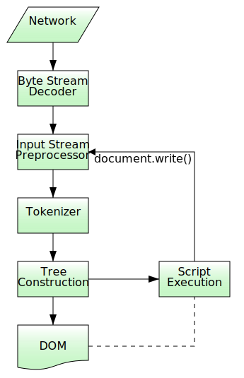

# parsing HTML documents

页面渲染离不开 DOM ，前提是需要对 HTML 文档进行解析。HTML parser 将 HTML 标记转换成文档对象模型 (DOM)。

过程：

```
字节流 -> 字符 -> Token -> 节点 -> DOM
```


1. **获取字节流**： 字节来源可以是从 _磁盘或网络_ 中读取的二进制原始字节。后续将根据文件的编码（如：UTF-8）转换成对应的字符。

2. **转换字符**：字符通常由字节流转换而来，但也可以来源于当前解析的 HTML 文档中的 script 脚本，例如：`document.write()`

3. **令牌化**: html parser 将字符串解析成 HTML token，例如：`script` tag、`div` tag 等。每个 token 都具有特殊含义和一组规则，例如：[script](https://html.spec.whatwg.org/#scripting-3)。

4. **词法分析**: 将每个 token 转换成包含自身规则及属性的 Node

5. **构建 DOM**: 将创建的 Node 链接成树状数据结构



参考：

- [parsing HTML documents - HTML Standard](https://html.spec.whatwg.org/#parsing)

- [Scripting - HTML Standard](https://html.spec.whatwg.org/#scripting-3)

- [Code points](https://infra.spec.whatwg.org/#code-point)

- [script start tag](https://html.spec.whatwg.org/#scriptTag)
