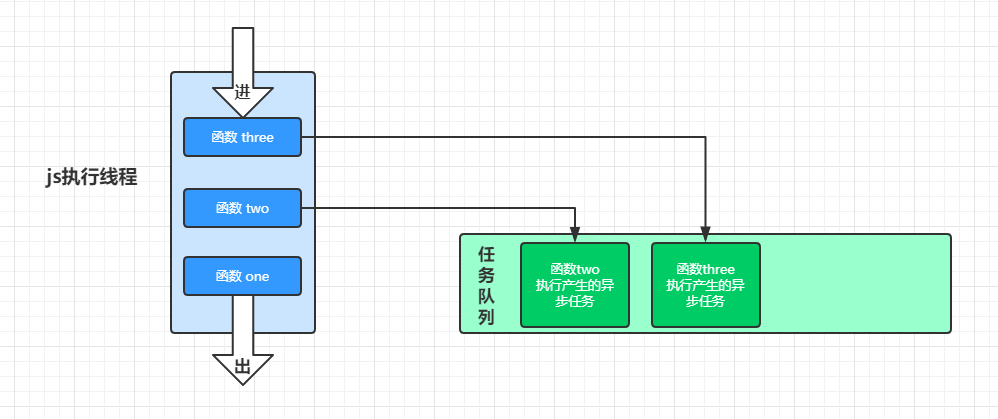
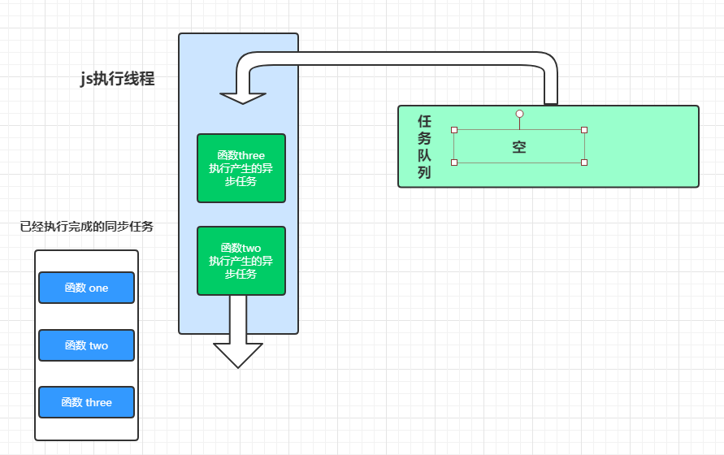

# Event Loop

JavaScript 是一个单线程、非阻塞、异步、解释执行的脚本语言。

## 为什么 JavaScript 要是单线程的

> JavaScript 在设计之初就是单线程的。考虑到 JavaScript 的用处：操作 DOM、处理各种交互，如果 JavaScript 被设计成多线程，那么当一个线程删除了一个 DOM 节点，而另一个线程却正在使用这个节点，此时，要怎么处理呢？为了避免这种复杂性问题，单线程无疑是很好的选择。

## 什么是单线程？

单线程，即任务按照顺序依次执行，后面的必须等到前面的执行完成后才能执行。如果前面的任务执行了很久，后面的任务就要一直等待。故而，单线程虽然简单，但效率却不高。所幸，在我们可以使用异步操作来提高效率。比如：在开发中常常需要进行数据请求操作，在发送请求后，如果一直等待接口返回数据后再进行操作，中间往往会有很长的空档期（IO、网络延迟）。如果在这段时间什么都不做的话，用户体验会很不好。因此往往会使用异步请求。

## JavaScript 运行时（runtime）

单线程跟异步？有的人可能会想，这不是互相矛盾吗？事实上，JavaScript 作为一个单线程执行的语言，确实不能实现异步，但是 _JavaScript 的 runtime（浏览器、NodeJs）_ 可以是多线程的。

**I/O 操作、定时器、事件监听等异步操作，都是 JavaScript runtime 通过其他线程来完成的。换句话说，像`setTimeout`这种 API 其实是 _JavaScript runtime_ 提供的，而不是 _JavaScript 引擎（如：V8）_ 提供的。** 例如：[Timers](https://html.spec.whatwg.org/#timers)

在浏览器中，通过[webAPI](https://developer.mozilla.org/zh-CN/docs/Web/API)给 JavaScript 提供异步实现。Node.js 中通过[libuv](https://github.com/libuv/libuv)给 JavaScript 提供异步功能实现。

> JavaScript runtime 包含 JavaScript 引擎

在浏览器(runtime)中，常见的异步操作指令有`setInterval`、`setTimeout`、`Promise`、`postMessage`、`MutationObserver`等。

## Event Loop

Event Loop 就是执行环境实现 JavaScript 异步的方式。先看下面代码：

```javascript
function one() {
  console.log(1)
}
function two() {
  setTimeout(()=>{
    console.log(2)
  })
+}
function three() {
  setTimeout(()=>{
    console.log(3)
  })
  // new Promise(resolve=>{
  //   resolve()
  // }).then(res=> {
  //   console.log(4)
  // })
}
one()
two()
three()
```

执行过程如下：


当 javascript 线程中`所有的同步任务执行完成后`，javascript 执行环境会读取异步任务队列，如果任务队列中有任务，则将所有任务拿到 javascript 线程上执行，过程如下：


参考：

- [Event Loop](https://html.spec.whatwg.org/#event-loops)

- [Tasks, microtasks, queues and schedules](https://jakearchibald.com/2015/tasks-microtasks-queues-and-schedules/?utm_source=html5weekly)

- [Timers - HTML Standard](https://html.spec.whatwg.org/#timers)
