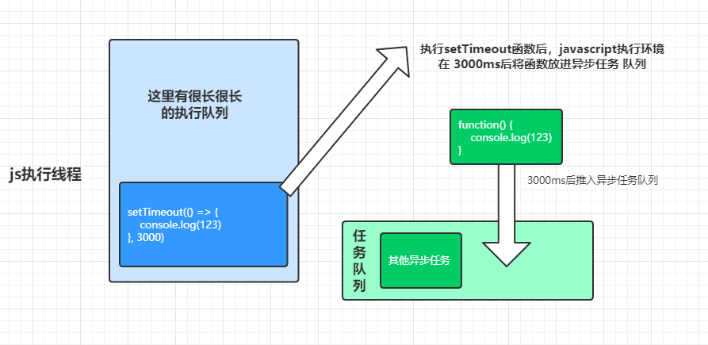

### setTimeout 异步

javascript 执行环境有一个专用线程负责管理时间延迟函数，当我们使用`setTimeout`函数时，javascript 执行环境的实现如下：

请注意，在 3000ms 后将函数推入任务队列，这意味着不一定会立即执行，如果此时 javascript 线程内还有很长很多的同步代码要执行，这个异步函数必须等到所有的同步任务执行完才能被推入 javascript 线程中执行，这就是为什么`setTimeout`延迟有时不能严格的按照设置的延迟时间进行执行。

参考：

- [Timers - HTML Standard](https://html.spec.whatwg.org/#timers)
