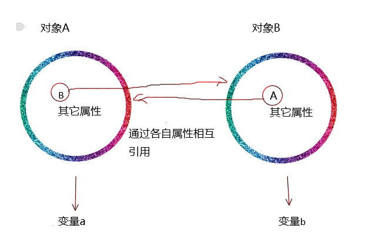

# 面试 2018-10-29

## javascript

### 1. 什么是闭包？
闭包，就是一个可以访问其他函数内部变量的 _函数_。MDN上的解释是：闭包是函数和声明该函数的词法环境的组合。

创建闭包常见的方式，就是在一个函数中创建另一个函数。一个简单的闭包如下：
```javascript
//这是一个防抖函数，闭包访问了 外部函数作用域的三个变量
function debounce(fn, duration) {
  let timer = null
  return function() {
    if(timer) clearTimeout(timer)
    timer = setTimeout(() => {
      fn()
    }, duration)
  }
}
```

闭包之所以可以访问另一个函数的变量，是因为每个函数创建时，都会创建一个包含着该函数*所在的函数作用域内所有变量的对象*，并保存在函数的`[[Scopes]]`属性上（这个属性是执行环境自己用的，不同执行环境的属性名可能不同）。当在函数内部访问某个变量值时，执行环境首先会在该函数内部寻找此变量，如果找不到，就会从`[[Scopes]]`中找（也就是函数的作用域链）。

### 2. 垃圾清除机制
>JavaScript具有自动垃圾收集机制，也就是说，执行环境会负责管理代码执行过程中使用的内存。这种垃圾收集机制的原理很简单：找出那些不再继续使用的变量，然后释放其占用的内存。为此，垃圾收集器会按照固定的时间间隔周期性的执行这一操作。

#### 1. 标记清除
这是最常用的垃圾收集方式。垃圾收集器运行时给在内存中的变量都打上一个标记，然后去掉那些在执行环境中的变量以及被执行环境中变量所引用到的变量（即当前正在执行的代码会用到的变量）的标记。剩下的带着标记的变量就是没用的变量了，因为正在执行的代码已经不需要访问这些变量了。最后，垃圾收集器会销毁这些没用的变量并回收内存。
#### 2. 引用计数
>在ie9之前的浏览器中，其BOM和DOM中的对象是使用C++以COM(Component Object Model, 组件对象模型)实现的，COM对象的垃圾收集机制采用的就是引用计数。

引用计数的含义是跟踪每一个值被引用的次数。当将一个值赋给某个变量时，这个值的引用次数就是1。如果该值又被赋值给另一个变量，这改值的引用次数加1。相反，如果引用着这个值的变量被赋予了其它值，则该值的引用次数减1。当一个值的引用次数是0，则说明没有变量指向该值，也就是无法再访问到该值，此时就可以销毁这个值，收回其占用内存。

但是当变量间循环引用时，例如：
```javascript
function problem() {
  var a = {}
  var b = {}
  a.B = b
  b.A = a
  a = null
  b = null
}
```
图例：

上面的例子中，两个对象A和B，分别赋值给变量a和b，同时通过各自的属性相互引用。也就是说，每个对象的引用次数都是2。之后，我们将变量a和b赋值为null，即不再指向对象A和B。此时，已经无法访问到对象A和B了（也就是没用了），但是由于两个对象互相引用，引用次数都为1。故，即使这两个对象已经没用了，但因为引用次数不为0，就不会被回收，一直占着内存。多几次这样的操作就会浪费掉大量内存。
