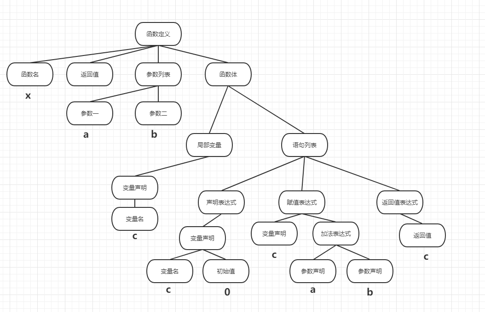

# 浅析编译原理

作为一名普通前端开发，对编译知识的需求还是比较低的，但其实如果留意的话，平时开发过程中还是会遇到很多跟编译有关的东西，不谈浏览器自身对于前端代码的解释执行，在开发的过程中我们使用的Babel就算是一种，Vue对于template html模板编译成AST也算一种，以及webpack的模块化打包等等。**编译过程的整个流程包括预处理、词法分析、语法分析、生成中间代码，生成目标代码，汇编，链接等。**

## 预处理

网络上的大部分关于预处理的解释都是关于C语言的，C语言的预处理分为：
- **#define宏定义**
- **#include文件包含**
- **#if()条件编译**

虽然说javascript不需要编译成机器码后发布，但是执行环境解释js源码并执行的时候也是少不了编译这个过程。按照我的理解，上面三个部分对应着javascript的编译大致如下（非常不精准的对应）：

##### 1. #define宏定义
可以理解为将`Math.PI`这种先转换成`3.1415926`

##### 2. #include文件包含
不知道怎么解释，虽然js也算有了模块化开发，但跟这个好像不是一回事

##### 3. #if()条件编译
在使用webpack做自动化开发时，我们会写一些类似于`if(process.env.NODE_ENV==='development')`之类的判断，此段代码只在开发环境有效，在生产环境中完全不会被执行，如果连这段代码一起打包会增加很多无用代码。所以在打包时，当webpack的解析器碰到这段代码后会自动删掉这些内容。

## 词法分析

编译器工作时最基础的部分就是正确的识别代码中的符号，指令。比如当编译器编译时遇到了`=`这个符号要怎么正确识别呢？这可能是个赋值语句（`x=2`）中的`=`，也可能是判断是否相等（x===3）中的其中一个`=`。编译器正确的分辨出这些指令的过程就是词法分析。

## 语法分析
在准确完成词法分析的基础上，编译器已经知道了每个单词，符号的含义，但这些单词组合起来表示的语法还不清楚，语法分析就是要完成这一过程。成功解析语法以后，我们会得到抽象语法树(AST: Abstract Syntax Tree)。 以这段代码为例:

```javascript
function x(a, b) {
  let c = 0
  c = a + b
  return c
}
```
语法树如下：


语法树将字符串格式的源代码转化为树状的数据结构，更容易被计算机理解和处理。 但它距离中间代码还有一定的距离。

vue、react等框架中都存在着虚拟DOM的概念，其实就是将html模板编译成AST，并进一步处理。

## 中间代码
>其实中间代码可以被省略，抽象语法树可以直接转化为目标代码(汇编代码)。 然而，不同的 CPU 的汇编语法并不一致，比如 AT&T与Intel汇编风格比较 这篇文章所提到的，Intel 架构和 AT&T 架构的汇编码中，源操作数和目标操作数位置恰好相反。 Intel 架构下操作数和立即数没有前缀但 AT&T 有。 因此一种比较高效的做法是先生成语言无关，CPU 也无关的中间代码，然后再生成对应各个 CPU 的汇编代码。

>生成中间代码是非常重要的一步，一方面它和语言无关，也和 CPU 与具体实现无关。 可以理解为中间代码是一种非常抽象，又非常普适的代码。 它客观中立的描述了代码要做的事情，如果用中文、英文来分别表示 C 和 Java 的话，中间码某种意义上可以被理解为世界语。

>另一方面，中间代码是编译器前端和后端的分界线。 编译器前端负责把源码转换成中间代码，编译器后端负责把中间代码转换成汇编代码。

对于前端的这些语言应该不需要这一步。

## 其它
汇编、链接就不说。

参考：

#### 1. [http://fullstack.blog/2017/06/24/大前端开发者需要了解的基础编译原理和语言知识/](http://fullstack.blog/2017/06/24/大前端开发者需要了解的基础编译原理和语言知识/)
#### 2. [编译预处理](https://blog.csdn.net/nodeBill/article/details/73004192)