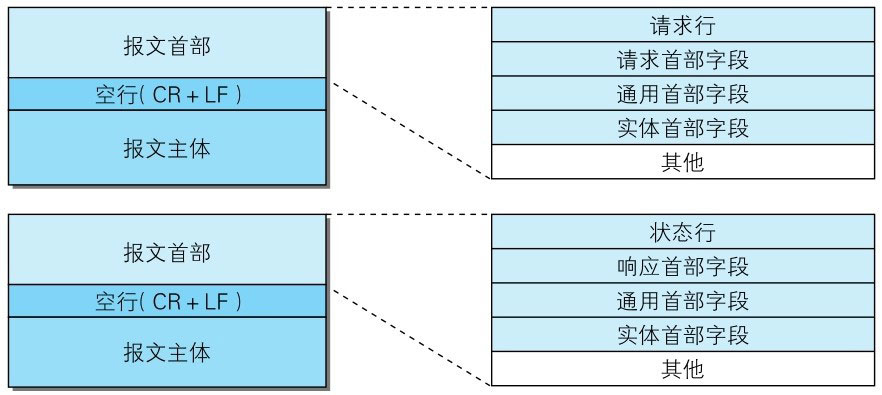
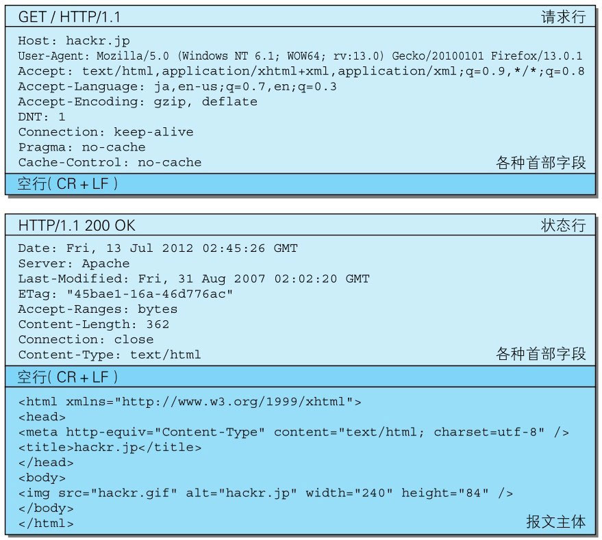
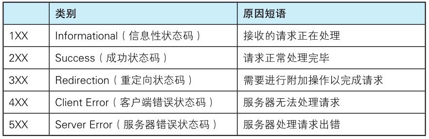
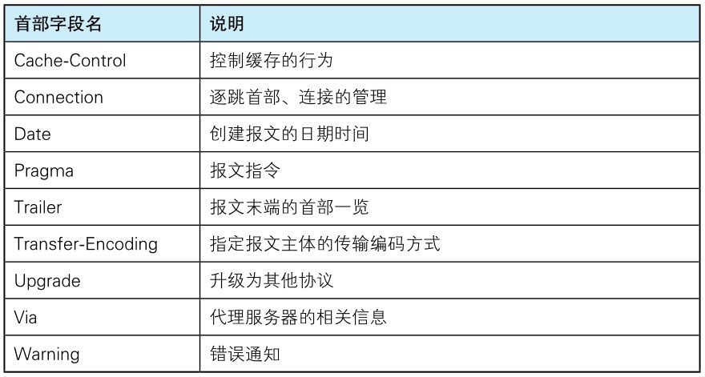
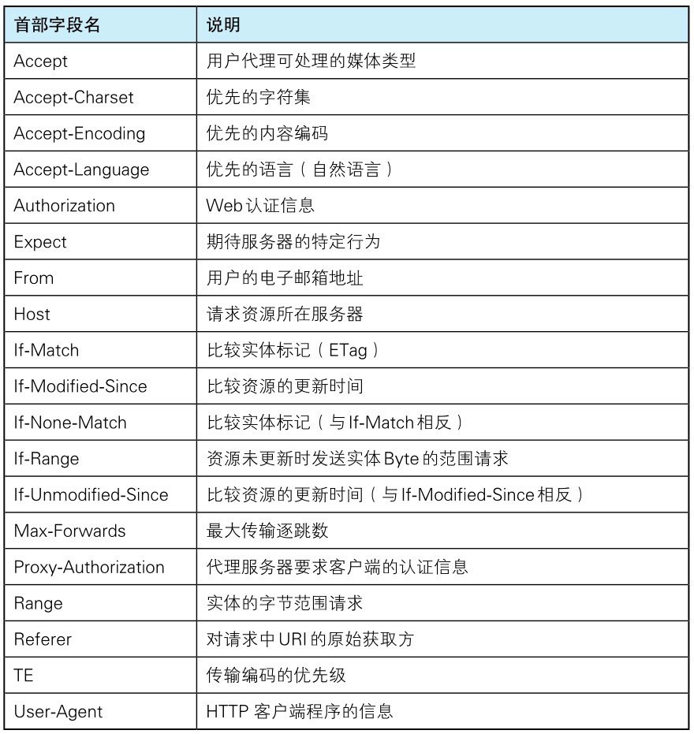
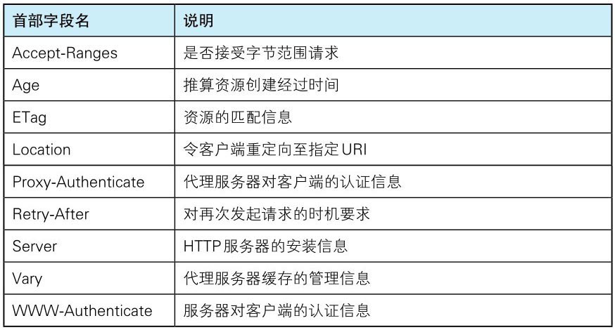
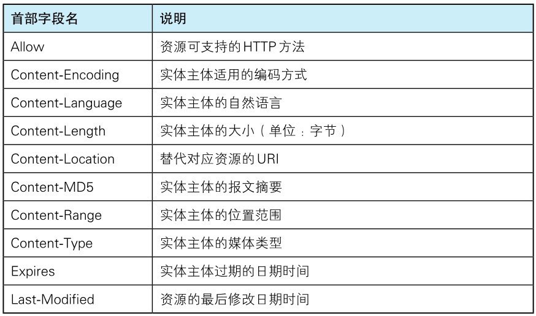

# HTTP

## 1. 前言

### **为解决文本传输而产生的 HTTP 协议**

> 1989 年 3 月，CERN（欧洲核子研究组织）的蒂姆·伯纳斯-李（Tim Berners-Lee）博士提出了一种能让远隔两地的研究者们共享知识的设想。最初设想的基本理念是：借助多文档之间相互关联形成的超文本（HyperText），连成可相互参阅的 WWW（World Wide Web，万维网）。
>
> 现在已提出了 3 项 WWW 构建技术，分别是：把 SGML（Standard GeneralizedMarkup Language，标准通用标记语言）作为页面的文本标记语言的 HTML（HyperText Markup Language，超文本标记语言）；作为文档传递协议的 HTTP；指定文档所在地址的 URL（Uniform Resource Locator，统一资源定位符）。

> **_当年 HTTP 协议的出现主要是为了解决文本传输的难题_**。由于协议本身非常简单，于是在此基础上设想了很多应用方法并投入了实际使用。现在 HTTP 协议已经超出了 Web 这个框架的局限，被运用到了各种场景里。

### **HTTP 协议具体做了啥**

协议，即协作双方（或多方）通过共同协商，达成统一意见后，订立的一种文书。通俗一点说，我们都认为这玩意（🐖）应该叫“zhu”，写作“猪”，那么我们以后的对话中，我说了“zhu”、写了“猪”，你就能明白我的意思了。同理，对于网络中通信的两台计算机，如果他们之间要进行通信，也需要商定对应的协议，否则，你管这个叫“猪”，我管这个叫“豚”，没法沟通。

计算机之间的通信协议，一般称之为“网络协议”，主要由`语法`，`语义`，`时序`三要素组成：

- 语法：即数据与控制信息的结构或格式；

- 语义：即需要发出何种控制信息，完成何种动作以及做出何种响应；

- 时序（同步），即事件实现顺序的详细说明。

http 协议作为网络协议的一种，自然也遵循这三要素。http 协议规定了通信报文的格式，规定了客户端（请求端）及服务端（响应端）如何响应报文，规定了总是要从客户端先发起连接，服务端响应请求并返回。

## 2. HTTP 基本信息

- HTTP 协议是用于客户端与服务端进行通信的协议

- HTTP 协议规定，请求总是从客户端发起，服务端响应该请求并返回（时序）

  - 请求

    请求报文是由请求方法、请求 URI、协议版本、可选的请求首部字段和内容实体构成的。

  - 响应

    响应报文基本上由协议版本、状态码（表示请求成功或失败的数字代码）、用以解释状态码的原因短语、可选的响应首部字段以及实体主体构成。

- HTTP 协议是一种无状态协议

  用 HTTP 协议，每当有新的请求发送时，就会有对应的新响应产生。协议本身并不保留之前一切的请求或响应报文的信息。这是为了更快地处理大量事务，确保协议的可伸缩性，而特意把 HTTP 协议设计成如此简单的。

  HTTP/1.1 虽然是无状态协议，但为了实现期望的保持状态功能，于是引入了 Cookie 技术。有了 Cookie 再用 HTTP 协议通信，就可以管理状态了。

## 3. HTTP 协议报文（message）格式（语法）

用于 HTTP 协议交互的信息被称为 HTTP 报文。请求端（客户端）的 HTTP 报文叫做请求报文，响应端（服务器端）的叫做响应报文。

HTTP 报文本身是由多行（用 CR+LF 作换行符）数据构成的字符串文本。

HTTP 报文大致可分为报文首部和报文主体两块。两者由空行（CR+LF）来划分。HTTP 协议的请求和响应报文中必定包含报文首部，并不一定要有报文主体。

### **HTTP 首部字段结构**

HTTP 首部字段是由首部字段名和字段值构成的，中间用冒号“:”分隔。

```
字段名: 字段值
```

字段值对应单个 HTTP 首部字段可以有多个值:

```
Keep-Alive: timeout=15, max = 10
```

#### **若 HTTP 首部字段重复了会如何**

> 当 HTTP 报文首部中出现了两个或两个以上具有相同首部字段名时会怎么样？这种情况在规范内尚未明确，根据浏览器内部处理逻辑的不同，结果可能并不一致。有些浏览器会优先处理第一次出现的首部字段，而有些则会优先处理最后出现的首部字段。




我们可以使用 Node.js 起一个 TCP 服务器，来具体看看 http 协议报文的内容：

```javascript
const net = require("net");
const server = net.createServer();

server.on("connection", (socket) => {
  console.log("客户端已连接");
  socket.on("end", () => {
    console.log("客户端已断开连接");
  });

  socket.on("data", (chunk) => {
    // 输出HTTP协议请求报文
    console.log(chunk.toString());
  });

  // 写入HTTP协议响应报文
  socket.write(
    "http/1.1 200 OK \r\n" /* 状态行 */ +
      "Content-Type:text/html\r\n" /* 用 CR+LF 作换行符 */ +
      "\r\n" /* 报文首部与报文主体由空行（CR+LF）来划分 */ +
      "<html><body>123</body></html>"
  );
  socket.end();
});

server.on("error", (err) => {
  throw err;
});
server.listen(3000, () => {
  console.log("服务器已启动");
});
```

### **请求报文格式**

```http
GET /api/net.html HTTP/1.1
Host: nodejs.cn
Connection: keep-alive
Cache-Control: max-age=0
DNT: 1
Upgrade-Insecure-Requests: 1
User-Agent: Mozilla/5.0 (Windows NT 10.0; Win64; x64) AppleWebKit/537.36 (KHTML, like Gecko) Chrome/86.0.4240.75 Safari/537.36 Edg/86.0.622.38
Accept: text/html,application/xhtml+xml,application/xml;q=0.9,image/webp,image/apng,*/*;q=0.8,application/signed-exchange;v=b3;q=0.9
Referer: http://nodejs.cn/api/net.html
Accept-Encoding: gzip, deflate
Accept-Language: zh-CN,zh;q=0.9,en;q=0.8,en-GB;q=0.7,en-US;q=0.6
If-None-Match: "5f7f1c39-1ec08"
If-Modified-Since: Thu, 08 Oct 2020 14:03:37 GMT
```

### **响应报文格式**

```http
HTTP/1.1 200 OK
Server: nginx/1.15.12
Date: Sun, 11 Oct 2020 10:19:26 GMT
Last-Modified: Thu, 08 Oct 2020 14:03:37 GMT
Expires: Sun, 11 Oct 2020 22:19:26 GMT
Cache-Control: max-age=43200
Content-Type: text/html
Content-Length: 125960
ETag: "5f7f1c39-1ec08"
Accept-Ranges: bytes
```

## 4. HTTP 状态码（语义）

状态码的职责是当客户端向服务器端发送请求时，描述返回的请求结果。

状态码如 200 OK，以 3 位数字和原因短语组成。

数字中的第一位指定了响应类别，后两位无分类。响应类别有以下 5 种：



只要遵守状态码类别的定义，即使改变 RFC2616 中定义的状态码，或服务器端自行创建状态码都没问题。

### **状态码和状况的不一致**

不少返回的状态码响应都是错误的，但是用户可能察觉不到这点。比如 Web 应用程序内部发生错误，状态码依然返回 200 OK，这种情况也经常遇到。

### **状态码**

- 1XX（处理中）

- 2XX（处理完成）

  - 200 成功处理
  - 204 成功处理，不允许返回**实体主体**

    > 代表服务器接收的请求已成功处理，但在返回的响应报文中不含实体的主体部分。另外，也不允许返回任何实体的主体

  - 206 范围请求，返回部分实体内容

    > 该状态码表示客户端进行了范围请求，而服务器成功执行了这部分的 GET 请求。响应报文中包含由 Content-Range 指定范围的实体内容。

- 3XX（重定向）

  - 301 Moved Permanently（永久重定向）

  - 302 Found（临时性重定向）

    > 该状态码表示请求的资源已被分配了新的 URI，希望用户（本次）能使用新的 URI 访问。换句话说，已移动的资源对应的 URI 将来还有可能发生改变。比如，用户把 URI 保存成书签，但不会像 301 状态码出现时那样去更新书签，而是仍旧保留返回 302 状态码的页面对应的 URI。

  - 303 See Other

    > 303 状态码和 302 Found 状态码有着相同的功能，但 303 状态码明确表示客户端应当采用 GET 方法获取资源，这点与 302 状态码有区别。

    > 当 301、302、303 响应状态码返回时，几乎所有的浏览器都会把 POST 改成 GET，并删除请求报文内的主体，之后请求会自动再次发送。

    > 301、302 标准是禁止将 POST 方法改变成 GET 方法的，但实际使用时大家都会这么做。

  - 304 Not Modified

    > 该状态码表示客户端发送附带条件的请求时，服务器端允许请求访问资源，但因发生请求未满足条件的情况后，直接返回 304 Not Modified（服务器端资源未改变，可直接使用客户端未过期的缓存）。304 状态码返回时，不包含任何响应的主体部分。_304 虽然被划分在 3XX 类别中，但是和重定向没有关系_。

    > 附带条件的请求是指采用 GET 方法的请求报文中包含 `If-Match`,`If-Modified-Since`,`If-None-Match`,`If-Range`,`If-Unmodified-Since` 中任一首部。

  - 307 Temporary Redirect 临时重定向

- 4XX（无法处理）

  4XX 的响应结果表明客户端是发生错误的原因所在。

  - 400 Bad Request

    > 表示请求报文中存在语法错误。 当错误发生时，需修改请求的内容后再次发送请求。另外，浏览器会像 200 OK 一样对待该状态码。

  - 401 Unauthorized

    > 该状态码表示发送的请求需要有通过 HTTP 认证（BASIC 认证、DIGEST 认证）的认证信息。另外若之前已进行过 1 次请求，则表示用户认证失败。

    > 返回含有 401 的响应必须包含一个适用于被请求资源的 WWW-Authenticate 首部用以质询（challenge）用户信息。当浏览器初次接收到 401 响应，会弹出认证用的对话窗口。

  - 403 Forbidden

    > 该状态码表明对请求资源的访问被服务器拒绝了。服务器端没有必要给出拒绝的详细理由

  - 404 Not Found

    > 该状态码表明服务器上无法找到请求的资源。除此之外，也可以在服务器端拒绝请求且不想说明理由时使用。

- 5XX（处理出错）

  5XX 的响应结果表明服务器本身发生错误。

  - 500 Internal Server Error

    > 该状态码表明服务器端在执行请求时发生了错误。也有可能是 Web 应用存在的 bug 或某些临时的故障。

  - 503 Service Unavailable

    > 该状态码表明服务器暂时处于超负载或正在进行停机维护，现在无法处理请求。如果事先得知解除以上状况需要的时间，最好写入 Retry-After 首部字段再返回给客户端。

## 5. HTTP 首部字段

在报文众多的字段当中，HTTP 首部字段包含的信息最为丰富。

首部字段同时存在于请求和响应报文内，并涵盖 HTTP 报文相关的内容信息。

因 HTTP 版本或扩展规范的变化，首部字段可支持的字段内容略有不同。

HTTP/1.1 规范定义了 47 种首部字段。

### **通用首部字段**

请求报文和响应报文两方都会使用的首部。



### **请求首部字段**

从客户端向服务器端发送请求报文时使用的首部。补充了请求的附加内容、客户端信息、响应内容相关优先级等信息。



### **响应首部字段**

从服务器端向客户端返回响应报文时使用的首部。补充了响应的附加内容，也会要求客户端附加额外的内容信息。



### **实体首部字段**



针对请求报文和响应报文的实体部分使用的首部。补充了资源内容更新时间等与实体有关的信息。

### **cookies 相关首部字段**

参考：

[协议-百度百科](https://baike.baidu.com/item/%E5%8D%8F%E8%AE%AE/13020269)
